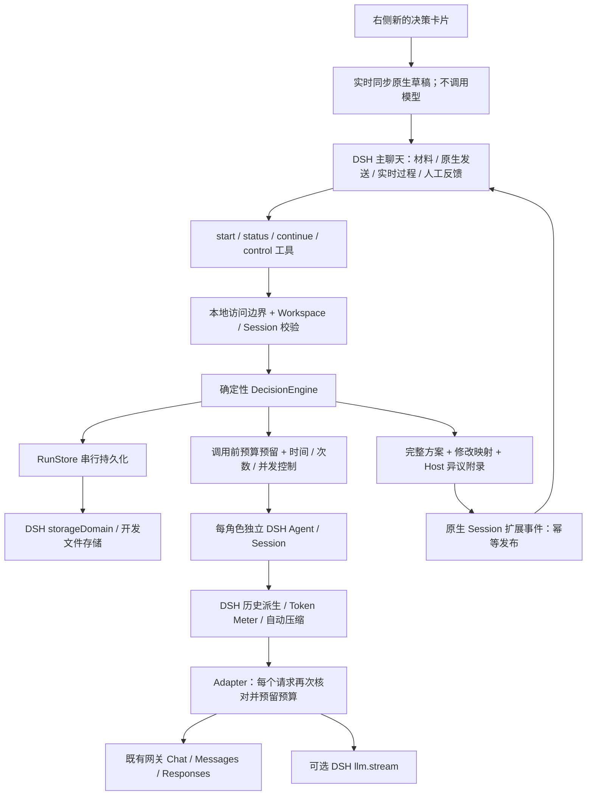

# 架构与可靠性边界

状态：`draft → running → completed`；任意未结束阶段可暂停或取消。暂停后在既有授权预算内继续；预算变更单独记录操作。已完成报告的人工取舍只允许记录一次，改意见需要新版本。

阶段：`independent → organize → discuss* → revise → verify → finished`。首轮必须所有席位成功才公开。单模型失败不静默减少覆盖，任务暂停；用户可继续重试或在新版本调整模型。

每个逻辑调用由 `phase:round:seatId` 定位，成功调用不重发。每次尝试有独立 ID、预算、usage 和 prompt hash。运行 epoch 在启动、暂停、取消时变化，响应必须与当前 epoch 匹配才可写入结论。失效响应只能保留用量回执。

所有任务共享最多四个并发请求；任务各自还有并发上限，最多两个任务处于运行中。预算预留和任务更新经同一 RunStore 互斥，不依赖 React 状态。预算存储失败时不发送请求。

讨论按问题分配给其他席位，新输入只发送分配的问题、相关回应和首评摘要，避免重复嵌入整份问题清单。各席位、主持、编辑和复核分别使用持久化 DSH 原生会话；首次提交完整材料，后续历史由 DSH 派生，并通过 standard Agent Preset 自动压缩。目标和硬约束固定在系统上下文中，原始记录继续保留。

压缩请求也必须在活动任务预算内先预留额度，标记 purpose=compaction，参与次数、费用和用量统计，不作为评审结果或首评完成信号。禁止隐式额外重试，失败回到任务检查点。单份输入过大仍会暂停；接管历史管理不等同于无限窗口。

主聊天使用 decision-room/message 原生 Session 扩展事件和 ConversationEvents 渲染器。消息 ID 来自任务与调用／事件 ID，重启补发时去重；不会伪造用户消息或修改原生 Agent 的 turn/step 计数。主 Agent 的系统上下文提供当前任务索引、目标、边界和未解决问题，完整结果通过只读工具读取。原始角色对话也可从 DSH 子代理会话追溯。

右侧卡片负责初始配置，材料、角色及预算实时同步为主聊天原生草稿；用户发送后由主持 Agent 调用工具，侧栏转为只读进度，后续交互都在主聊天完成。使用原生输入服务，不扫描并写入任意 textarea；同源消息桥校验 iframe 来源、Session、当前选择、卡片可见性和未发送状态，只有上一份自动生成的草稿可被连续更新，不覆盖用户手工编辑。卡片与最后生成文本按工作空间／会话缓存在当前标签页 sessionStorage，刷新后仍遵守相同保护。

工具启动按 Workspace/Session 串行化，以真实 user/message 的 ID 持久化去重。工具重试不会重复创建已授权任务；草稿提交不先创建付费任务。续议默认继承上一版修订稿与原预算，只有明确要求重新评审时才启动。原始输入、旧版本和既有调用均保留。

执行卡片使用 decision-room/progress 原生事件，首条建立节点，后续按同一任务身份更新；历史窗口只有更新片段时也能恢复显示。卡片只投影状态、用量和调用元信息，不泄露尚未揭示的独立评审。独立开发预览保留完整工作台，用于核心流程调试。

终止条件包括人工收尾、所有回应认为无需继续、当前回应都需要新证据、与上一轮结构化内容完全重复、轮数或调用额度。完全重复检测仅是机械保障，不能判断所有同义复述；语义收敛仍依赖模型判断和用户检查。因此必须保留时间与预算上限。

若调用次数即将耗尽，优先保留修订、复核两次调用。Token/金额不足以预留下一步，或时间耗尽，则暂停，允许导出阶段性记录并明确尚未完成完整方案。不能在没有预算的情况下承诺额外免费收尾。

模型输出必须符合 Zod schema；程序校验问题覆盖和材料引用 ID 的存在。程序不能证明引用对主张的语义支持，也不能证明外部事实。事实和证据缺口问题即使被复核模型标记 addressed，也维持 needs_evidence。

运行记录保存模型配置摘要 hash；模型配置改变会拒绝继续旧任务，需核对后创建新版本。Host 环境变量对应的实际网关地址或凭据变化属于运维配置边界，应停止运行任务再调整；不得以同一变量名悄悄变更供应商。

开发文件存储是单进程本地预览后端，不支持两个进程同时写同一个目录；DSH 运行使用 Profile 自己的持久化服务。该首版不提供分布式任务锁、用户账户、远程反向代理鉴权或 SaaS 租户隔离。
