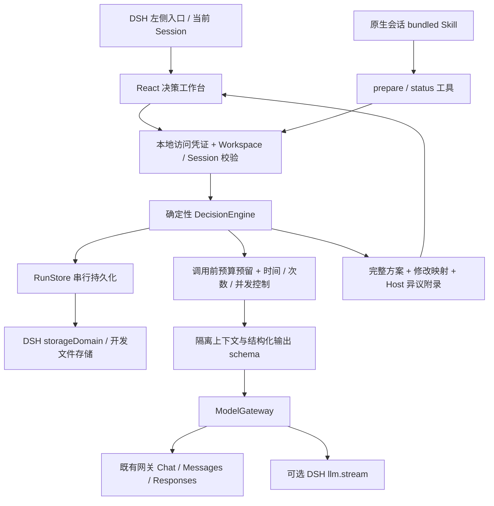

# 架构与可靠性边界

状态：`draft → running → completed`；任意未结束阶段可暂停或取消。暂停后在既有授权预算内继续；预算变更单独记录操作。已完成报告的人工取舍只允许记录一次，改意见需要新版本。

阶段：`independent → organize → discuss* → revise → verify → finished`。首轮必须所有席位成功才公开。单模型失败不静默减少覆盖，任务暂停；用户可继续重试或在新版本调整模型。

每个逻辑调用由 `phase:round:seatId` 定位，成功调用不重发。每次尝试有独立 ID、预算、usage 和 prompt hash。运行 epoch 在启动、暂停、取消时变化，响应必须与当前 epoch 匹配才可写入结论。失效响应只能保留用量回执。

所有任务共享最多四个并发请求；任务各自还有并发上限，最多两个任务处于运行中。预算预留和任务更新经同一 RunStore 互斥，不依赖 React 状态。预算存储失败时不发送请求。

讨论按问题分配给其他席位，保留近两轮交叉回应，且每次都带原始材料、全部问题和原始独立评审。长讨论不会不断拼接完整聊天；超出模型的保守上下文容量会暂停，不截掉硬约束。

终止条件包括人工收尾、所有回应认为无需继续、当前回应都需要新证据、与上一轮结构化内容完全重复、轮数或调用额度。完全重复检测仅是机械保障，不能判断所有同义复述；语义收敛仍依赖模型判断和用户检查。因此必须保留时间与预算上限。

若调用次数即将耗尽，优先保留修订、复核两次调用。Token/金额不足以预留下一步，或时间耗尽，则暂停，允许导出阶段性记录并明确尚未完成完整方案。不能在没有预算的情况下承诺额外免费收尾。

模型输出必须符合 Zod schema；程序校验问题覆盖和材料引用 ID 的存在。程序不能证明引用对主张的语义支持，也不能证明外部事实。事实和证据缺口问题即使被复核模型标记 addressed，也维持 needs_evidence。

运行记录保存模型配置摘要 hash；模型配置改变会拒绝继续旧任务，需核对后创建新版本。Host 环境变量对应的实际网关地址或凭据变化属于运维配置边界，应停止运行任务再调整；不得以同一变量名悄悄变更供应商。

开发文件存储是单进程本地预览后端，不支持两个进程同时写同一个目录；DSH 运行使用 Profile 自己的持久化服务。该首版不提供分布式任务锁、用户账户、远程反向代理鉴权或 SaaS 租户隔离。
