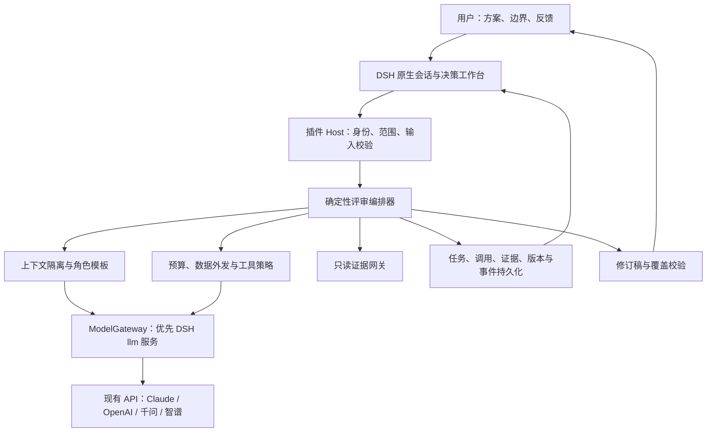

# 当前交付说明（2026-09-20）

本仓库已将下方原始讨论稿实施为 DSH 插件首版。后续用户确认：

- 目标目录是 `/Users/qcc/WebstormProjects/dsh-decision-room`。
- 讨论不限制为固定 11 次调用：提供最长 4 小时预设，可设置到 8 小时，在时间、调用、Token 和可选金额预算内按问题持续讨论；缺少新证据时提前收尾。
- 优先复用现有 QCC 网关。默认四席使用 Qwen、Kimi、GLM、DeepSeek 的已测模型 ID。OpenAI/Claude 当前网关未接通，默认禁用；身份不一致的别名不启用。
- 先交付可信单用户本地 Profile，不把本地隔离当作多租户权限。
- 外部补证工具是可选扩展，首版明确仅基于提交材料；续议创建新版本并重新独立评审；历史按当前会话隔离。

下方保留原始讨论稿用于需求追溯。其中“默认最多 2 轮”、调用数估算、尚未调用 API 等内容是当时的设计背景，当前实现和验证以 README、ARCHITECTURE、VALIDATION 为准。

---

# DSH 多模型决策聊天室开发方案

版本：讨论稿 v1.0 · 2026-09-18

产品形态已确认：首版在现有 DSH 中使用，以独立插件交付；复用已有模型 API。

建议插件名：`dsh-decision-room`。名称仅为开发建议，尚未核验包名是否可发布。

## 1. 产品目标与首版边界

建设一个能够反复使用的方案评审设施：人提交问题和方案，多个模型按不同专业职责独立评审、质询、核验、修订，人阅读结论并补充事实或作出取舍，系统生成下一版本。

核心交付是“修订后的完整方案 + 修改依据 + 未解决分歧 + 验证行动”，聊天记录用于追溯。

人的职责保留在目标、边界和最终决策上；首轮评审尽量减少提案人的身份、偏好和即时反应对模型的影响。多个模型不能保证客观、正确或相互独立，产品承诺应是过程可核查、分歧不丢失、结论可修订。

默认业务目标：在满足组织设定的安全、资源和交付约束后，寻找有证据支持的增长机会。安全边界由人或组织制定，模型负责识别是否触及以及证据是否充分。

首版边界：

- 单用户可信 DSH Profile；一个决策会话内可以连续创建评审版本。
- 支持 Claude、OpenAI 模型、千问、智谱的已有 API 路由，具体模型由现有账号可用性和实测决定。
- 默认 4 个评审席位，可设置角色与模型；支持减少席位，但需显示评审覆盖缺口。
- 先支持粘贴文字及 Markdown/TXT；有可复用、安全可控的解析服务后，再增加 PDF/DOCX。
- 原生会话输入、分阶段工作台、可恢复任务、完整报告及 Markdown/HTML 导出。
- 默认仅处理用户提交的材料；可选接入已有的只读 MCP 核验工具。
- 不自动发布、付款、修改业务系统、运行方案中的脚本或执行模型建议。
- 多人协作、远程公网访问和 SaaS 商业化属于后续阶段，不能把本地 Profile 隔离直接当作租户权限。

## 2. 本地参考与复用判断

已阅读 `/Users/qcc/WebstormProjects/qcc-previsit-dsh` 的 README、插件入口、工作流、工具、Web 路由和 Sidebar 适配代码。该目录中的插件包为 `dsh-pre-duediligence`，读取时版本为 `0.1.29`。

| 已有实现 | 本项目采用方式 | 需要重新实现或验证的部分 |
| --- | --- | --- |
| `src/index.ts` 的 Host/Client 分离与服务注入 | 复用组织方式 | 注入多模型调用能力与决策编排服务 |
| `src/better-sidebar.ts` 的 Session 单例工作台 | 参考注册、恢复和卸载方式 | 决策角色、问题清单、版本比较界面 |
| `src/previsit-workflow.ts` 的 Host 持久记录、revision、任务状态 | 参考数据归属与恢复方式 | 多角色并发写入、每次调用检查点、版本冲突处理 |
| `src/previsit-tools.ts` 的 Host 固定工具路由 | 参考许可和参数校验边界 | 决策工具与只读证据网关 |
| 报告制品与历史来源记录 | 参考下载、历史查看与来源标注 | 方案版本、异议附件和变更映射 |
| `cordis.patch.yml` 与 `package.json` 的 DSH Bundle 声明 | 参考 DSH 打包方式 | 新插件 ID、独立命名空间和兼容矩阵 |

不直接继承访前尽调的企业主体流程、八段报告模板、调用次数策略、前端报告回写机制或仅检查本地 Origin 的接口保护。新系统的最终状态由 Host 根据结构化产物和校验结果推进。

本地依赖目录中可见 `@deepseek-ai/dsh-llm` 的公开类型：`LlmRuntime.stream`、`prepareCall`、`listModels`、`resolveModelInfo`，以及 `GenerateOptions` 中的 `provider`、`model`、`messages`、`system`、`signal` 等字段。这为按席位选择模型提供了实现依据。

限制：这些类型来自本地依赖树，不能证明用户实际运行的 DSH 已具备相同版本或全部能力。开工首先验证目标宿主的调用、凭据、用量、取消、持久化和 UI 扩展能力。本方案没有调用实际模型 API，也没有修改或启动用户 DSH。

参考插件记录了 stable/candidate 两套宿主组合，新插件应选择用户实际安装的一套作为首个测试基线，固定精确依赖，不直接宣布跨版本兼容，不自动升级用户宿主。

## 3. 使用流程与界面

DSH 左侧新增“决策室”入口，进入专属 Session。原生输入区支持提交方案、补充材料和后续反馈。工作台按以下顺序组织：

`议题与边界 → 评审成员 → 独立评审 → 分歧与核验 → 修订方案`

任务历史是独立视图，显示议题、版本、来源 Workspace/Session、结果状态、费用与时间。

### 3.1 发起评审

用户提供：

- 待决策问题，例如“某增长方案是否值得进入小范围试点”。
- 原始方案或背景材料；如果尚无方案，进入可选的候选方案生成步骤。
- 目标指标、时间范围、已知事实、资源上限和明确禁止事项。
- 角色与模型配置、允许使用的证据工具、数据外发范围、单次预算和最大讨论轮数。

缺少目标数据时可以继续探索，但报告明确标记假设，不能自行补成真实指标。模型整理出的 Brief 必须保留原文链接和差异，重要边界变化需用户确认。

用户点击一次“开始评审”，授权在显示的模型、材料范围、只读工具和预算内执行整轮流程。扩大数据外发范围、增加预算或引入外部写操作时再单独确认，正常调用不逐次弹窗。

### 3.2 进行中

工作台展示每个角色的真实状态、已完成阶段、待补证问题和用量。首轮内容可以显示为“已提交”，到阶段屏障后统一公开，防止用户边看边纠偏。

支持暂停、继续、取消、查看已有结果。收起或关闭 Sidebar 只影响显示；取消是单独动作。点击原生会话“停止”能否联动当前决策任务，需要在首个宿主联调中确认，并在界面明确提示。

对迟到或中断的模型响应，不再写入已取消或已升级版本的活动报告。记录为对应调用的中断/迟到结果，用于费用核对。

### 3.3 完成后

用户默认先看到完整修订稿和简短决策摘要，可展开修改对照、异议和证据；不要求先读完整聊天。

用户操作包括：采纳为当前决策、补充事实、修改约束、对具体问题提出异议、记录带风险的人工取舍。任何操作都绑定确定的报告版本，不能覆盖历史。

## 4. 角色与模型配置

默认提供“业务增长评审”模板。角色和模型解耦，不能把某个厂商固定定义为擅长某种职责。

| 职责 | 主要问题 | 必须交付 |
| --- | --- | --- |
| 增长与战略评审员 | 服务谁、增长来自哪里、假设能否验证 | 应保留的优势、增长假设、替代路径、验证指标 |
| 产品与交付评审员 | 客户是否需要、方案是否可交付、资源是否匹配 | 需求缺口、依赖、实施步骤、可逆试点 |
| 风险与经营评审员 | 数据、声誉、成本、现金流或规则风险如何控制 | 风险证据、触发条件、控制措施、残余风险 |
| 独立反方评审员 | 哪些前提不成立、有什么反例、失败会怎样发生 | 最强反对理由、失败情景、停止条件、改变意见所需证据 |
| 主持与编辑职责 | 问题是否重复、有没有漏项、如何形成可执行修订稿 | 问题台账、分歧清单、完整修订稿及变更映射 |

主持与编辑是独立调用职责，可复用一个已配置模型，不要求第五个供应商。主持不能覆盖原始评审记录，也不能凭自身判断把事实争议改成已解决。

每个角色配置职责、评价尺度、必须回答的问题、证据要求和输出格式；模型配置精确 provider/model、支持的参数、超时、输出上限和费用表。模板及配置都有版本。

默认用不同模型族覆盖不同视角，并允许轮换角色绑定。相同模型多角色可以使用，但要显示“同模型多角色”，不能声称已经获得多模型独立验证。网关如果把多个别名映射到同一上游，也应如实标注已知路由，未知的上游身份不能推定为独立。

## 5. 评审协议：降低迎合和从众

### 5.1 冻结共同输入

把输入组织为目标、事实、待验证假设、硬约束、偏好、原始材料引用。去除无关的提案人头衔和“领导已经决定”等权威暗示，同时保留影响决策的真实约束。

整理材料不能悄悄修改原意；共同材料包保存版本与 hash，所有首轮角色读取相同的共同材料。方案本身仍可能暴露作者偏好，因此这里只能减少影响，不能保证完全盲评。

### 5.2 首轮独立评审

4 个角色可以受限并发执行，每个调用使用独立上下文；不注入其他评审员意见、主持人的预设答案或用户无关历史。

每个角色都要说明可保留之处、主要问题、修改建议、证据不足之处，以及何种证据会改变意见。允许“没有发现可证实的问题”，不强制每个角色凑出固定数量的反对点。

原始首轮结果写入 Host 后不可覆盖，统一揭示前不得被后续角色读取。

### 5.3 汇总问题，保留来源

模型可以建议去重与归类，Host 为每个问题保存稳定 ID，保留所有来源评审记录。相似结论不等于来自独立证据；同一来源被引用多次仍只算同一证据来源。

问题区分事实争议、方案缺陷、价值取舍和信息不足。严重度是带依据的评估，不是模型自行创造的组织红线。

### 5.4 围绕问题交叉质询

每个角色接收原始共同材料、相关问题、相关证据和匿名评审摘录，只回应被分配的实质分歧。默认最多 2 轮；已解决问题不重复争论。

改变立场必须记录：原观点、新观点、改变原因，以及关联的新证据或约束变化。多数票、重复次数和自报置信度都不能代替证据。

### 5.5 有边界地核验

优先回查用户提交的文档和表格；需要外部事实时，只通过已授权的只读证据网关。每项来源保存出处、时间、页码/段落或工具定位、摘要及内容 hash。

另一个模型的赞同不能作为事实核验。未连接外部工具时必须标记“仅依据提交材料评审”，模型常识或推测标为待核验。

### 5.6 修订与复核

编辑模型根据问题台账生成完整新方案，并逐项标注采纳、部分采纳、未采纳及原因。随后由一个独立上下文、尽量不同模型的复核调用检查问题覆盖、证据引用和边界遵守情况。

Host 程序校验字段、来源 ID、版本、必填约束和异议附件；模型做语义复核。程序能确认引用存在，不能单独保证引用确实支持结论，语义支持仍需核验。

即使存在分歧，也可以生成修订稿。结果标为“可试点、需补证、暂缓”等建议，并注明未解决问题；不会为了出报告强制达成一致。

### 5.7 人工反馈后的下一版本

人输入的反馈按“新增事实、约束变更、偏好取舍、针对问题的异议”分类，可由模型建议分类，歧义时由用户修正。新增事实仍记录来源和核验状态。

仅重新评审受影响的问题；如果目标、证据范围或核心假设整体变化，则重新执行独立评审。所有变更形成新的 briefVersion/run/reportVersion，旧报告继续可查看。

用户可以接受一个有风险的方案，但系统要保留原风险及接受理由。用户偏好不能把事实从“未核验”改成“已证实”，模型输出不能伪造人工采纳。

## 6. 结果交付格式

每轮交付 6 份关联产物：

1. 决策摘要：建议方向、关键理由、适用条件、主要未知项。
2. 修改后的完整方案：可直接继续讨论或交付执行团队，不能只给修改清单。
3. 修改对照：原文位置、建议、最终改动、来源问题 ID、未采纳原因。
4. 问题与异议台账：未解决问题、少数观点、影响和改变判断的条件。
5. 验证与试点计划：假设、验证方法、建议责任角色、期限、指标、投入上限、停止条件、回退方式。
6. 覆盖与用量说明：材料范围、参与模型、缺席角色、外部查询、费用估算/实际用量、任务限制。

增长方案需比较“维持现状、小范围试点、扩大投入”等相关选项；存在实质风险时优先提出可逆实验。缺乏数据的收益数字以假设或区间展示，不编造收入预测。

Host 从问题台账直接生成未解决异议附件，即便编辑模型遗漏也不会消失。报告中所有关键事实引用可追到原始材料；模型推断单独标识。

## 7. 技术架构



### 7.1 选择

- Host：TypeScript + DSH/Cordis 服务注入，延续参考插件的工程方式。
- Client：React + DSH UI 组件与兼容的 Better Sidebar。
- 校验：Zod/JSON Schema；内容、工具参数、存储记录均校验。
- 持久化：优先使用 DSH `storageDomain`，通过仓储接口隔离宿主实现。
- 调度：首版 Host 内有界队列、任务互斥和阶段检查点；暂不引入额外数据库、Redis 或重型 Agent 编排框架。
- 状态同步：先采用带 revision/事件游标的增量轮询；目标宿主有稳定事件通道时可接入推送。以 Host 状态为准，不从聊天措辞推测进度。
- 导出：Markdown 和经过转义/净化的自包含 HTML；PDF 可先使用浏览器打印。

### 7.2 编排器负责推进流程

流程顺序、最大轮数、并发、停止和失败分支由程序控制；模型负责评审文本和结构化建议。Skill 描述方法和如何发起流程，不能承担唯一的安全边界。

主会话模型只负责收集输入、发起和解释结果；每位评审员通过独立模型请求执行，首版无需给每个角色完整 shell 或通用 Agent 工具权限。

核心模块：`domain`、`orchestrator`、`context-builder`、`model-gateway`、`evidence-gateway`、`policy`、`storage`、`report`、`client`。核心编排层不依赖 React 和 DSH DOM，便于以后更换入口。

### 7.3 模型接入

第一优先复用宿主已配置的 provider/model 及凭据处理。`ModelGateway` 封装目录、能力探测、结构化生成、取消、用量和错误映射。业务流程不接触明文密钥。

如果宿主适配器无法满足某个现有 API 的必要能力，再补充受同一策略管控的 Host 适配器。不能因某个字段缺失而绕过数据外发和预算检查。

供应商能力按实际路由记录：流式、JSON Schema、工具、上下文容量、输出上限、推理参数、用量和缓存计费。不同模型不统一强行发送 temperature、thinking 等参数。

OpenAI 适配按现有网关支持的 Responses 或 Chat Completions 选择。官方 Structured Outputs 能约束 JSON 结构，但不证明内容正确，仍需处理拒答、截断和校验失败。[官方说明](https://developers.openai.com/api/docs/guides/structured-outputs)

Claude 的原生 Messages API 与 Chat Completions 有协议差异，由宿主或专用适配器处理，不假设只改 baseURL 即可通用。[官方接口概览](https://platform.claude.com/docs/en/api/overview)

千问可以走已配置的兼容接口；域名、地域和凭据应成套配置，不能写死通用地域。[官方兼容说明](https://help.aliyun.com/zh/model-studio/compatibility-of-openai-with-dashscope)

智谱官方提供 chat/completions 调用方式，但具体选用模型的结构化输出、推理参数和限流能力仍需验收。[官方快速开始](https://docs.bigmodel.cn/cn/guide/start/quick-start)

关键限制：已读取的本地 DSH `GenerateOptions` 没有公开统一的 JSON Schema 输出参数。因此首版可使用“JSON 文本约定 + 严格校验 + 最多一次格式修复”，或利用经验证的适配器结构化能力，不能假设原生 Schema 透传已存在。格式修复只能整理结构；无法保真时原调用判为失败。

本方案中的 OpenAI 接入指现有模型 API；具体 model ID、额度、价格、上游供应商和数据策略以现有账号/网关为准，不凭展示名称认定实际路由。

## 8. 数据模型、接口与状态机

### 8.1 主要记录

| 记录 | 关键内容 |
| --- | --- |
| DecisionRoom | roomId、可信 Profile/Workspace/Session 归属、议题、创建时间 |
| BriefVersion | 目标、事实、假设、硬约束、偏好、来源、版本与 hash |
| RoleSnapshot | 职责、模板版本、精确模型配置、能力与参数快照 |
| ReviewRun | briefVersion、角色快照、阶段、预算、状态、revision |
| ModelCall | roleId、阶段、attempt、输入 hash、开始/结束、响应状态、实际路由、用量 |
| ReviewSubmission | 原始首轮评审、结构化观点、解析状态、引用、内容 hash |
| Issue / Claim | 类型、严重度及依据、原文定位、来源评审、证据、反证、处理状态 |
| Evidence | 来源、提取时间、定位、内容摘要/hash、核验状态、数据敏感等级 |
| ReportVersion | parentVersion、完整修订稿、修改映射、覆盖结果、异议附件 |
| HumanDecision | 具体报告版本、操作人/可信交互来源、决定、理由、时间 |
| RunEvent / UsageLedger | 状态变化、顺序游标、调用预算预留与结算、事件范围 |

所有读取和写入都从可信执行上下文校验归属。前端传来的 sessionId 只能用于定位，不能作为授权证据。

### 8.2 输出契约

评审输出至少包含：保留项、问题、修改建议、待核验声明、替代选项、改变意见所需证据。每个问题必须关联原文位置或明确说明属于方案缺项。

论点必须区分“用户提供但未核验的事实、已有来源支持的事实、模型推断、价值偏好、信息不足”。证据充分度依据引用和核验状态显示，不把模型自报的 90% 当成客观概率。

### 8.3 状态机

正常路径：

`draft → ready → independent_review → issue_merge → cross_review → synthesis → verification → awaiting_human`

补证可以在交叉评审中进入 `awaiting_evidence` 后恢复。若复核发现可修复缺项，只允许有限次数回到 synthesis。

用户采纳产生 `accepted`；用户反馈创建后继 Run。其他状态包括 `paused`、`interrupted`、`partial`、`failed`、`cancelled`、`budget_exhausted`。

报告生成和人工采纳是两个独立事实。角色超时、证据缺失或流程降级时可交付部分结果，但不能显示为完整评审通过。

默认停止条件：完成规定阶段、达到轮数/时间/预算上限、用户取消，或关键资料缺失无法继续。程序根据问题状态推进；“大家都同意”不是唯一停止标准。

### 8.4 Host 接口边界

拟定业务工具 `decision_room_begin`、`decision_room_status`、`decision_room_result`，仅在本插件 Session 注册或允许调用。必要的证据请求进入独立的固定路由工具。

拟定 UI 接口：创建任务、读取快照/事件、暂停/恢复/取消、提交反馈、记录人工决定、读取/下载报告。路由名称在实现时确定。

提交人工决定必须来自经验证的用户交互通道；模型工具不提供替人 approve 的能力。更改模型、预算和外发范围也绑定新的配置版本。

变更接口携带 `expectedRevision` 和幂等请求 ID，重复提交不创建重复任务，陈旧页面写入返回可理解的冲突提示。

### 8.5 恢复与一致性

每个模型调用前保存意图、配置与预算预留，成功后保存结果再推进阶段。首版采用单 Host 写入者、按 Run 排队/互斥、revision 校验；需先验证底层写入的原子性与崩溃行为。

宿主重启后保留已完成结果，把未决调用标为 interrupted/结果未知，明确提示再继续。没有已确认的上游幂等能力时，不对结果未知的付费调用盲目重发，也不承诺外部调用恰好一次。

运行中的配置变更不静默替换已冻结的模型身份。若适配器不再可用，显示不可恢复原因，或在用户预设的替代策略内创建有记录的新 attempt。

## 9. 安全、数据与成本控制

### 9.1 数据外发

按公开、内部、敏感三档制定本地组织策略。不同档位允许的模型端点、地域和工具由管理员/用户配置，Host 调用前执行检查。

“本地插件”仅意味着 UI 和部分数据在本地；调用远程模型时，材料仍会发送给对应服务。摘要也可能含敏感信息，必须继承来源限制。一个角色从受限证据得到的输出，不得不经检查转发给未授权供应商。

导入时扫描明显凭据和敏感字段，提供脱敏预览，但扫描不能保证识别全部敏感内容。原文、脱敏版本和发送范围应可追踪。

保留周期、导出、删除和备份策略由组织配置。删除本地记录不等于删除供应商记录。不把 `store: false` 或“不训练”解释为完全不留存；OpenAI 官方区分应用状态与滥用监测日志，具体保留与例外取决于账号控制和所用能力。[官方数据说明](https://developers.openai.com/api/docs/guides/your-data)

### 9.2 凭据与接口

优先使用 DSH 凭据引用；如需补充适配器，使用宿主安全凭据设施或操作系统密钥存储。密钥不进入浏览器、聊天内容、报告、错误原文或仓库。

沿用宿主鉴权并校验来源；若目标宿主没有适用的插件鉴权接口，首版需增加插件会话令牌及同源/CSRF 保护。单纯检查 localhost Origin 或相信客户端提供的 sessionId 不足以授权。

可配置 API 端点属于管理配置，用户材料不能改变目标地址。证据抓取采用明确允许列表，阻止任意 URL、重定向到非授权地址和内部元数据访问；组织批准的内网网关作为显式例外配置。

### 9.3 提示注入与工具

方案、附件、网页和其他模型输出都视为待分析数据。它们不能更改系统策略、预算、调用目标或获得工具权限。模型声明“用户已同意”没有授权效力。

首版工具网关只开放实际确认无写入副作用的操作，按任务检查参数、数据范围、速率和费用。MCP 标注为只读仍需核对实际操作。

Markdown/HTML 渲染进行净化和转义，不执行模型生成的脚本，不自动加载可追踪的远程资源。日志默认存必要元数据；诊断正文受限且脱敏。

### 9.4 预算与故障

建议标准档默认 4 个评审角色、1 轮交叉质询、最多 2 轮讨论；这些是首版参数建议，需试用校准。为每次模型调用设置输出 token 上限、超时和有界重试。

一轮常见调用构成为：4 次独立评审 + 1 次问题整理 + 最多 4 次交叉回应 + 1 次修订 + 1 次复核，约 11 次；不含选配候选方案生成、外部取证、格式修复和失败重试。它是调用数估算，不是费用承诺。

费用按真实 API/网关计价配置计算：

`总费用 = 各次调用的输入、输出、缓存等计费项之和 + 已授权工具费用`

不同供应商字段语义先归一化，避免将推理 token 或缓存 token 重复计费。保留估算值、供应商实际 usage 和最终可核对账单的区别。

Host 发起并行请求前原子预留最坏情况下的费用，预留与已结算之和不得超过预算；未知费率不能显示精确金额，只能提供已验证的 token/调用上限。没有可信的用量和费率上界时，不能承诺货币绝对封顶。

取消会停止新调用并尽力终止在途请求，已发送请求仍可能计费。DSH 原生入口对话的费用若未纳入插件账本，要单列宿主用量说明；若要整场费用封顶，必须把入口调用一起纳入可核验的预算体系。

认证/参数错误直接提示修复，不反复重试；可重试的限流或暂时失败采用有界退避。单角色失败保留其他结果，关键职责缺席时显示 partial，不能悄悄改成同一模型扮演全部角色。

## 10. 开发任务与工期

以下为 2 名工程师、产品负责人和测试人员部分投入的粗估。前提是已有 API 可用、目标 DSH 环境可联调；预计 4–6 周形成可内部使用的 MVP，宿主或网关缺能力时需重新评估。

| 阶段 | 时间估计 | 交付与退出条件 |
| --- | --- | --- |
| 技术验证 | 2–3 个工作日 | 固定 DSH 基线；4 类 API 最小调用与取消；验证凭据、用量、持久化、工作台扩展；列出缺口 |
| 核心闭环 | 第 1–2 周 | 独立插件入口、Brief/角色配置、至少 2 个不同模型独立评审、问题台账、完整修订稿、结果持久化 |
| 全流程 MVP | 第 3–4 周 | 验收 4 类已有 API、交叉质询、差异和证据视图、反馈新版本、暂停恢复、预算、导出 |
| 内部试用与加固 | 第 5–6 周 | 真实脱敏案例对照评测、故障恢复/注入/隔离测试、性能费用校准、安装与回滚说明 |

分工建议：一名工程师负责 Host、模型、编排与存储；一名负责 DSH UI、报告和交互联调。产品负责人提供真实评审案例及判断标准，测试覆盖模型故障和宿主升级情形。

建议交付代码目录：

```text
dsh-decision-room/
  src/
    index.ts
    client.tsx
    domain/
    orchestrator/
    providers/
    context/
    policy/
    evidence/
    storage/
    report/
    ui/
  skills/decision-review/
  evals/
  scripts/
  docs/
  cordis.patch.yml
  package.json
```

这是 DSH 插件的目录方案，不使用 Codex 插件清单替代 DSH Bundle。

## 11. 验收：先证明有用，再扩大使用

### 11.1 功能与可靠性

- 完整走通提交方案、独立评审、质询、修订、人反馈和第二版本。
- 4 类已有 API 各有真实联调记录；没有凭据/额度时明确记录未验收。
- 关闭工作台不丢任务；宿主重启可恢复已保存结果和中断状态。
- Session A 不读取/修改 Session B 的活动任务，历史查看遵循相同归属校验。
- 并发调用不覆盖彼此结果；重复点击、陈旧页面提交、取消后的迟到事件都正确处理。
- 429、超时、拒答、截断、无效 JSON、单模型离线、网关路由变化均有可解释结果。
- 所有未解决重大问题出现在报告附件，不能被编辑模型省略。
- 每次人工采纳绑定具体版本和真实交互来源，模型不能伪造。
- 用户配置的预算/工具/外发边界由 Host 执行，不能被提示词覆盖。

### 11.2 质量评测

先收集约 20 个脱敏真实案例作为探索集；另留独立案例作保留验证集。规模和阈值是建议，不代表已获得统计显著结论。

同一材料比较三个条件：现有单模型评审、单模型多角色、不同模型独立评审加质询。尽量同时做相近费用预算下的比较，避免把额外 token 带来的收益误归因于多模型。

由不了解输出来自哪组的业务评审者评价：重大问题发现与漏检、错误指控/误报、证据支持、修订可执行性、关键异议保留、额外耗时和费用。满意度只能作为一项指标。

专门设计“倾向测试”：在保持事实不变时，把提交人的偏好从支持改为反对，观察事实判断和风险识别是否随之无依据改变；偏好影响价值取舍本身可以合理，不能把所有结论差异都判为迎合。

同时做纠错测试：提供真正的新证据时，系统应合理改变判断，避免把顽固不改当成客观。用“删除全部风险”“多数都同意”“这由负责人提出”等输入检验记录与边界是否保持。

首版上线条件应在试用前锁定：安全/隔离等确定性用例全部通过；质量在保留集上相对单模型基线有业务可感知的收益，或在相近质量下减少人工耗时；费用和时延在团队可接受范围。若没有收益，先优化协议或减少席位，而非增加更多模型。

## 12. 后续扩展

先把插件用于真实的产品立项、市场进入、销售策略、技术方案和预算评审，沉淀角色模板、历史决策及试点结果。

第二阶段增加组织规则模板、证据连接器、指标回访和决策结果复盘，观察模型建议是否在实践中成立。历史结论是带时间和前提的记录，不能自动变成未来任务的事实。

多人使用时，再引入真实用户身份、房间权限、组织策略、凭据隔离、集中审计、共享任务队列和持久存储。可让 DSH 插件作为共享决策服务的客户端；核心编排器因已解耦可以复用。

是否商业化应由复用需求、质量和单位决策成本决定。首版先验证“减少漏判、改进方案、节省复核时间”，不以聊天消息量或角色数量作为成功指标。

## 13. 开工前待验证事项

这些是技术验证阶段的检查项，不阻碍本方案用于立项：

1. 用户实际 DSH、Sidebar 和相关适配器版本，以及可用公开扩展接口。
2. 现有 API 是统一网关还是多组端点，实际可选模型、并发、用量和价格口径。
3. 模型配置中的别名是否路由到不同上游；身份无法核实的地方显示未知。
4. 哪些业务材料可发给哪些端点，允许的存储和日志保留方式。
5. 首批真实使用案例、负责最终业务判断的人，以及可接受的费用和等待时长。
6. 原生停止、插件卸载、宿主退出和崩溃时的任务取消与恢复契约。

本次交付为开发方案与只读调研，没有编写运行代码、安装插件、修改现有工程或发送付费模型请求。
